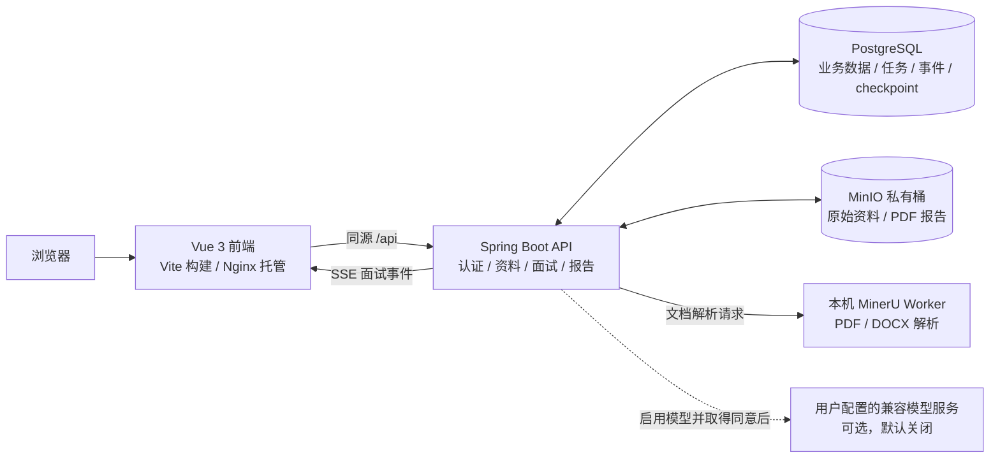
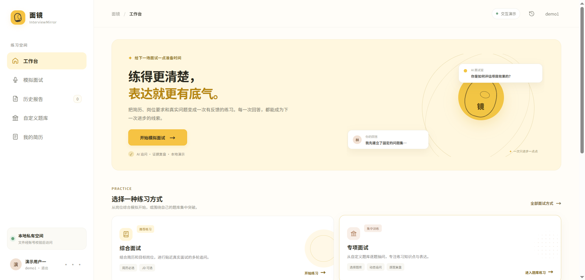
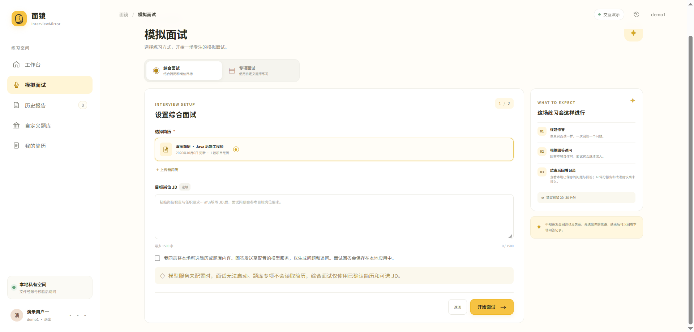
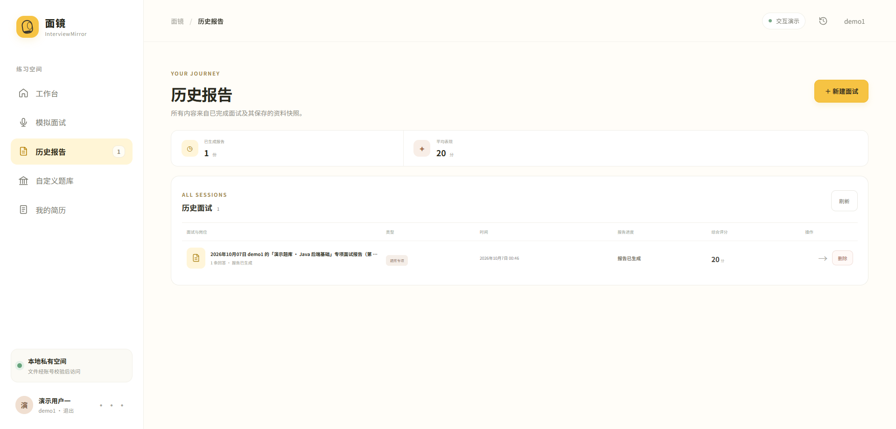
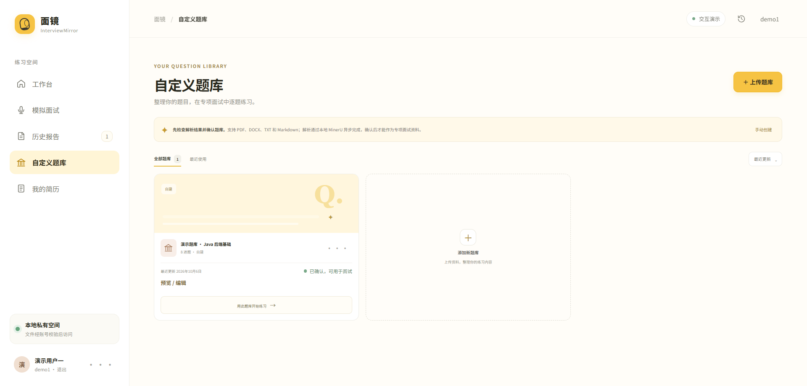
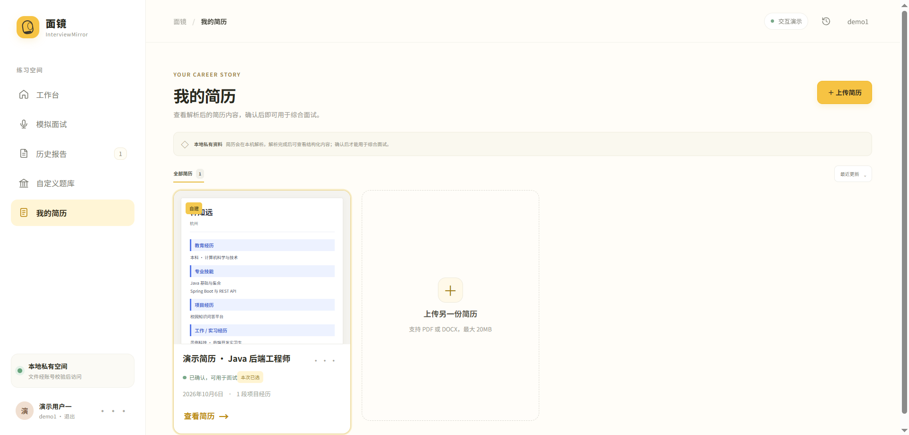

# 面镜 InterviewMirror

> 面向求职者的本地 AI 模拟面试与复盘工具。通过简历、目标岗位和自定义题库，把练习、问答记录与报告整理在同一条流程里。

## 项目介绍

InterviewMirror 是一个本地运行的 AI 面试练习应用，适合准备技术岗位面试、整理个人简历和复习自定义题库。用户可以导入简历或题库，检查解析结果并确认资料，再进行综合面试或题库专项面试。面试结束后，系统会异步生成报告，支持查看历史记录和导出 PDF。

项目重点是建立一条可追溯的本地练习流程：

```text
简历 / 自定义题库 → 确认资料 → 模拟面试 → 保存问答 → 生成报告 → 导出 PDF
```

本项目当前定位为个人本地演示与开发，不提供注册、公网部署或生产级多租户服务。模型调用默认关闭；启用模型后，简历和回答会发送到 `.env` 中配置的模型服务，并遵循界面上的资料处理同意提示。

## 系统架构



前端通过 Nginx 访问后端 API，Session Cookie 和 CSRF 校验由服务端管理。PostgreSQL 使用 Flyway 自动迁移；简历、题库、面试记录和报告都按当前登录用户隔离。MinIO 使用私有桶，浏览器不会拿到对象存储凭证或永久文件 URL。

## 技术栈

### 前端

| 技术 | 用途 |
| --- | --- |
| Vue 3.5 | 页面与交互 |
| JavaScript ES Modules | 前端业务代码 |
| Vite 7 | 开发服务器与生产构建 |
| Node.js 测试运行器 | 前端单元测试 |
| Nginx | Compose 环境下托管静态页面并反向代理 `/api/` |

### 后端与基础设施

| 技术 | 用途 |
| --- | --- |
| Java 21、Spring Boot 4.1.1 | 后端应用与 REST API |
| Spring Security | Session 认证、CSRF 与当前用户上下文 |
| Spring JDBC | PostgreSQL 访问与用户范围查询 |
| Flyway | 数据库版本迁移与初始化 |
| Spring AI 2.0.1 | OpenAI-compatible 模型接入 |
| LangGraph4j 1.8.27 | 面试流程状态与 PostgreSQL checkpoint |
| PostgreSQL 17.6 | 用户、资料、面试、任务和报告持久化 |
| MinIO | 私有文件与 PDF 对象存储 |
| Python 3.12、MinerU 4.0.10 | 本机 PDF / DOCX 文档解析 Worker |
| Docker Compose | 本地启动前端、后端、PostgreSQL 与 MinIO |

## 功能特性

### 简历管理

- 上传 PDF 或 DOCX，异步解析并在简历卡片和详情页查看结构化内容。
- 展示基本信息、教育经历、专业技能、项目经历等解析结果。
- 支持解析状态查看、失败重试、资料确认和删除；确认后的简历才可用于综合面试。
- 解析 Worker 在本机运行，简历文件保存在私有 MinIO 中。

### 自定义题库

- 上传 PDF、DOCX、TXT 或 Markdown 题库，也可以手工创建题库。
- 解析问题与参考答案，支持多行答案、题目增删改和分类编辑。
- 解析或编辑后的题库需确认；后端会校验归属、状态和题目数量。
- 专项面试要求题库至少包含 6 道有效题目。

### 综合与专项模拟面试

- 综合面试基于已确认简历生成问题，可填写 JD 作为问题生成上下文。
- 专项面试从已确认的自定义题库中抽取问题。
- 回答先持久化再推进流程；支持 SSE 事件、断线恢复和历史问答查看。
- 每个主问题可进行有限次数的追问；专项面试在存在备用题时支持换题。
- 开始面试前显示资料处理同意提示；未配置模型时不会创建面试记录。

### 历史报告与 PDF

- 面试完成后异步生成报告，历史列表展示生成状态与进度。
- 报告包含总体评价、按面试模式展示的能力维度和逐题回顾。
- 支持查看报告、失败重试、删除和中文 PDF 导出。
- 岗位差异分析已从当前产品中停用。

### 认证与数据隔离

- 本地演示账号使用服务端 Session、HttpOnly Cookie 和 CSRF 校验。
- 简历、题库、解析任务、面试和报告的查询均由后端按当前用户隔离。
- 文件类型、MIME 和签名由服务端校验；对象桶保持私有。

## 效果展示

以下截图按首页、模拟面试、历史报告、自定义题库、我的简历的顺序排列。

### 1. 首页



### 2. 模拟面试



### 3. 历史报告



### 4. 自定义题库



### 5. 我的简历



## 项目结构

```text
InterviewMirror/
├── frontend/                  # Vue 3 前端、Vite、Nginx 与前端 Dockerfile
│   ├── src/                   # 页面、API 客户端、展示逻辑与前端测试
│   ├── package.json
│   ├── vite.config.js
│   ├── nginx.conf
│   └── Dockerfile
├── backend/                   # Spring Boot 后端
│   ├── src/main/java/local/interviewmirror/backend/
│   │   ├── documents/         # 简历、题库与解析任务
│   │   ├── interviews/        # 面试流程、问答与恢复
│   │   ├── reports/           # 报告生成、历史与 PDF
│   │   ├── files/             # MinIO 文件访问
│   │   ├── security/           # 登录、Session 与用户上下文
│   │   └── common/             # 通用配置与基础组件
│   ├── src/main/resources/db/migration/  # Flyway migration
│   ├── src/test/              # 后端单元与集成测试
│   ├── pom.xml
│   └── Dockerfile
├── scripts/                   # MinerU Worker、smoke、评测与阶段脚本
├── docs/                      # 阶段说明、架构、验收与截图
├── data/                      # PoC 与评测数据
├── docker-compose.yml         # 本地应用服务编排
└── .env.example               # 本地环境变量模板
```

## 快速开始

### 环境要求

| 场景 | 需要安装 |
| --- | --- |
| Docker 运行完整应用 | Docker Desktop 或 Docker Engine + Docker Compose v2 |
| 前端本地开发 | Node.js 22、npm |
| 后端本地开发 / 测试 | Java 21、Maven 3.9+ |
| 简历及 PDF / DOCX 题库解析 | 已准备好的本机 MinerU 4.0.10 环境与模型文件 |

只用 Docker 启动 Web 应用时，无需在宿主机安装 Java、Maven、Node 或数据库。首次构建需要下载容器镜像和依赖。

### 克隆与启动

```bash
git clone https://github.com/ihyam30/InterviewMirror.git
cd InterviewMirror
cp .env.example .env
docker compose up --build -d
docker compose ps
```

Windows PowerShell 复制环境文件时使用：

```powershell
Copy-Item .env.example .env
docker compose up --build -d
docker compose ps
```

首次启动会自动运行 Flyway、创建私有 MinIO bucket 和本地演示账号。服务健康后打开：

| 服务 | 地址 |
| --- | --- |
| 前端 | <http://127.0.0.1:5173> |
| 后端健康检查 | <http://127.0.0.1:8080/actuator/health> |
| MinIO Console | <http://127.0.0.1:9001> |
| PostgreSQL | `127.0.0.1:15432` |

演示账号仅供本机使用，默认密码可在 `.env` 中更改：

| 用户名 | 示例密码 |
| --- | --- |
| `demo1` | `MirrorDemo1!` |
| `demo2` | `MirrorDemo2!` |

### 启用模型面试

模型调用默认关闭。需要面试出题或生成报告时，在 `.env` 配置兼容模型服务，例如：

```dotenv
INTERVIEW_MODEL_ENABLED=true
INTERVIEW_MODEL_PROVIDER=QWEN
INTERVIEW_MODEL_BASE_URL=https://dashscope.aliyuncs.com/compatible-mode/v1
INTERVIEW_MODEL_API_KEY=替换为你自己的模型服务密钥
INTERVIEW_MODEL_ID=qwen-plus-2025-12-01
```

然后重建后端容器：

```bash
docker compose up -d --build backend
```

不要把真实 API Key 提交到仓库。启用模型后，只有在用户同意资料处理时才会把相关简历或回答发送给所配置的服务。

### 启用 MinerU 文档解析

PDF / DOCX 简历和题库解析需要本机 MinerU Worker。先在 `.env` 中为 `MINERU_WORKER_TOKEN` 设置独立随机值（至少 32 个字符），然后在 Windows PowerShell 启动 Worker：

```powershell
pwsh -File .\scripts\phase2\start-mineru-worker.ps1
```

Worker 绑定本机回环地址，不使用云解析服务。TXT / Markdown 题库由后端直接读取文本。Worker 不运行时，解析任务会显示失败状态；启动 Worker 后可在资料页面重试。

## Docker 快速部署

Compose 会启动四个核心服务：

| 容器 | 职责 |
| --- | --- |
| `frontend` | Nginx 托管 Vue 静态资源并代理 `/api/` |
| `backend` | Spring Boot API、面试与报告 Worker、Flyway |
| `postgres` | 保存账户、资料、面试、报告和任务状态 |
| `minio` | 私有文件及 PDF 对象存储 |

从项目根目录执行：

```bash
cp .env.example .env
docker compose up --build -d
docker compose ps
```

常用命令：

```bash
# 查看服务日志
docker compose logs -f backend frontend

# 停止服务，保留数据卷
docker compose down

# 删除服务并重置数据库和文件（会清除本地数据）
docker compose down --volumes --remove-orphans
```

所有 Compose 宿主机端口默认只绑定 `127.0.0.1`，这是本地演示配置，不应直接暴露到公网。MinIO Community 上游已归档；当前 Compose 构建配置仅面向个人本地演示，若用于共享环境应先更换受支持的对象存储并重新审查安全配置。

## 使用场景

- **求职者个人练习：**用自己的简历开始综合面试，围绕目标岗位描述练习项目和技术问题。
- **专项复习：**把常见题目导入或手工整理成题库，确认后进行有针对性的问答练习。
- **面试复盘：**回看历史问答与报告，导出 PDF 保存阶段性练习记录。
- **本地项目演示：**展示 Vue、Spring Boot、异步任务、PostgreSQL、MinIO、MinerU 和模型服务的集成流程。

本地演示账号和数据空间适合个人验证与功能演示；当前不提供面向 HR 的批量简历处理、团队协作或公网多租户能力。

## 开发与测试

```bash
# 前端测试与构建
npm ci --prefix frontend
npm test --prefix frontend
npm run build --prefix frontend

# 后端测试
mvn -B -f backend/pom.xml test

# Compose 配置检查
docker compose config --quiet
```

项目阶段文档和详细验收记录位于 [`docs/`](docs/)，包括资料解析、面试运行时、报告生成和本地演示说明。

## 安全与数据说明

- `.env` 仅用于本机配置，已被 Git 忽略；不要提交密码、对象存储凭证或模型密钥。
- 用户资料通过服务端 Session 认证，并在后端按 owner 隔离；MinIO bucket 不公开。
- 开启模型服务前请确认供应商、模型和资料处理范围；传输内容受对应供应商的数据策略约束。
- 当前 Compose 仅绑定 loopback，项目没有完成公网生产部署与生产级账号管理验收。

## 许可证

InterviewMirror 项目自有源代码和文档采用 [Apache License 2.0](LICENSE)。第三方依赖、MinIO、MinerU、模型/字体及外部服务均按各自条款管理，不会因本项目许可证而改变。Compose 当前包含单独许可的 MinIO Server，仅用于本地演示；完整发布边界和待办审查见 [`docs/OPEN_SOURCE_RELEASE_CHECKLIST.md`](docs/OPEN_SOURCE_RELEASE_CHECKLIST.md)。

演示账号、示例密码和 `.env.example` 中的本地默认值只供绑定回环地址的个人演示。不要把这些值用于共享环境或公网部署。
