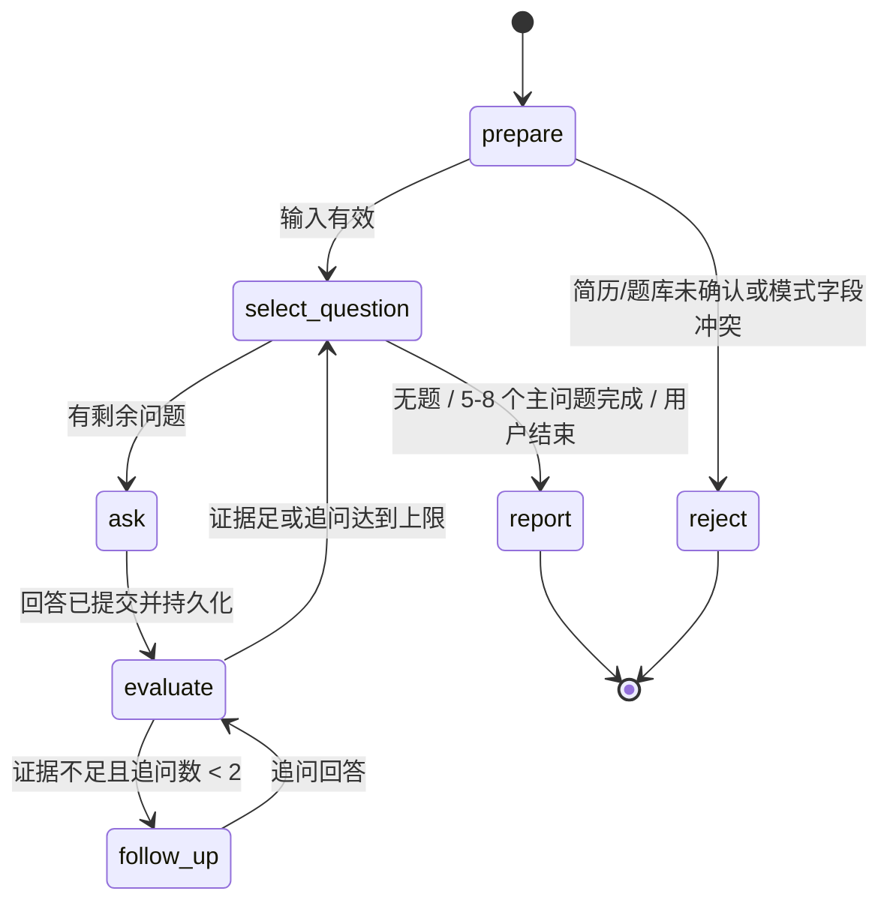

# LangGraph4j 本地 PoC

**契约版本：** `interviewmirror.langgraph-poc.v1.0.0`  
**代码版本：** `scripts/poc/langgraph4j/`  
**计划基线：** `DEVELOPMENT_PLAN.md` 第 4、6、9、11 节

## 目标和范围

验证 Java 21 + LangGraph4j 1.8.x LTS + PostgreSQL 16.4+ 的模式校验、条件分支、持久化和进程重启恢复。PoC 用确定性节点模拟回答与报告，不调用模型，不引入 PostgreSQL 以外的中间件。版本固定为 LangGraph4j `1.8.27`，依赖由 Maven 缓存复现。

## 状态图



状态包含 `mode`、确认资料标记、JD 是否存在、问题列表、当前题号、每题追问计数、回答与证据、结束原因、已访问节点和报告状态。综合模式要求已确认简历，题库字段必须为空；专项模式要求已确认题库，简历/JD 必须为空。每场主问题限制 5–8（PoC fixture 使用 2 题以缩短运行），每主问题最多追问 2 次。PoC 实际节点步数上限为 80；生产节点另配置 30 秒模型调用超时与 1 次受限重试，超时转可重试状态并保留已保存回答。

## Checkpoint 设计

采用 LangGraph4j `1.8.27` 版本提供的 `PostgresSaver` V1，表结构位于 PostgreSQL 16.4+，thread id 对应面试场次；每个节点完成后由 checkpointer 保存图状态。该锁定版本 jar 仅提供 V1 API；后续升级时需评估 saver schema 迁移兼容，避免把当前 PoC 表直接视为最终线上迁移。

PoC 在进程 A 注入异常中止于 `ask` 后，验证保存快照 `lastNode=ask, nextNode=evaluate`；进程 B 使用 `GraphInput.resume()` 和相同 thread ID 跨 JVM 恢复，从 `evaluate` 接续至 `report`。若以空 `Map` 调用图，会被 LangGraph4j 当作全新 `GraphArgs` 而重跑开始节点，因此 PoC 显式使用 resume 输入，并断言 `prepare` 节点只执行一次。实际镜像 PostgreSQL `16.15`，image id `sha256:cf78e76683b9ca8c5733cbbdce6c9262b45b6767934dd0a95e671f9a0fc20685`，满足计划 16.4+ 基线。合成数据不含个人资料。生产删除面试时需同时删除业务记录和 thread checkpoint。

## 可复现命令

先确保 Docker Desktop/Engine 正在运行：

```powershell
pwsh -File .\scripts\poc\langgraph4j\run-poc.ps1
```

脚本启动临时 `postgres:16-alpine`（本次为 16.15）并通过 `maven:3.9.9-eclipse-temurin-21` 编译运行，执行 JUnit 模式校验、三种条件路由、故障注入和新 JVM 恢复。数据库只映射到 `127.0.0.1:55432`，完成后容器停止并自动删除。无需另装 Maven。

## 结果与证据

| 检查项 | 状态 | 证据 |
|---|---|---|
| Java 编译 / JUnit | 通过；2 tests、0 failures/errors | `mvn -q test package`；`ModeRulesTest` 覆盖综合简历必选/JD 可选、专项题库必选/简历 JD 互斥 |
| 条件路由 | 通过；3 场 | 综合 + 题库专项均到 `report`；无简历的综合请求到 `reject` 且 `reportReady=false` |
| PostgreSQL checkpoint 保存 | 通过 | 故障注入 `crashCheckpoint ... lastNode=ask nextNode=evaluate`；执行到 `evaluate` 前抛异常 |
| 跨 JVM 恢复 | 通过 | 新 Maven/JVM `resumeOk ... beforeNode=ask nextNode=evaluate afterNode=report ... reportReady=true`；恢复路径断言 `prepare` 未被重放 |
| Git 基线和工作区 | 已记录 | HEAD `4d856e17ab03111ea28e9f2d621d37867f88c071`，dirty `true`；容器日志含基线 |

脚本实跑时经历并修复了两类集成问题：1.8.27 的节点/边 API 是异步签名，改用 `AsyncNodeAction.node_async` / `AsyncEdgeAction.edge_async`；异常被图运行器包装为 `GraphRunnerException`，据 cause 校验模拟崩溃；跨进程继续必须传 `GraphInput.resume()`。最终整链通过，未使用内存 saver 冒充持久化。开发机其他已有容器（KnowEngine PostgreSQL/RocketMQ）保持未触碰。

## 方案与依据

按计划选 LangGraph4j 1.8.x LTS，与 Java 21 和 PostgreSQL saver 路线一致。LangGraph4j 提供状态图、条件边及 checkpoint saver；本 PoC 固定补丁版以避免动态版本漂移。依赖和官方资料见 [LangGraph4j 1.8 LTS](https://github.com/langgraph4j/langgraph4j) 与 [PostgreSQL saver](https://github.com/langgraph4j/langgraph4j/tree/main/langgraph4j-postgres-saver)。
