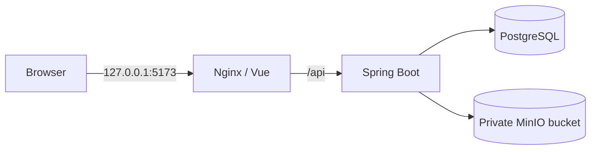

# 阶段 1 本地工程说明

## 组件结构

- `src/`：保留 Vue 3 + Vite 产品交互；`src/api.js` 统一请求、Session Cookie、CSRF、错误和认证失效处理。
- `backend/`：Java 21 / Spring Boot 分层应用：Controller → Service → Repository。SQL 使用 JdbcTemplate，迁移由 Flyway 托管。
- `postgres`：保存用户、通用演示资源和文件元数据。
- `minio`：保存原始文件；私有桶在后端启动时确保创建。只有后端容器拿到 S3 凭证。
- `frontend`：Nginx 提供 Vue 静态资源，并将 `/api/` 反向代理到后端，避免浏览器跨域共享 Cookie。



## 数据库和资源授权

Migration：`backend/src/main/resources/db/migration/V1__create_local_application_schema.sql`。启动时 Flyway 自动执行。业务表包括 `app_users`、`demo_resources`、`stored_files`；用户删除会级联清理其资源和文件记录，文件记录删除会将引用它的 `file_id` 置空。

认证成功后，后端从 Spring Security `Authentication` 取得 `AccountPrincipal.id`。资源 API 通过 `WHERE id = ? AND owner_id = ?` 执行单记录读取、更新和删除。文件 API 通过 `WHERE id = ? AND owner_id = ?` 先查 metadata，再用数据库返回的不可外露 `object_key` 访问 S3。请求体中没有 ownerId 字段；没有按用户输入对象 key 读取文件的 API，也没有预签名 URL API。

登录采用服务端 Session；浏览器只持有 HttpOnly session cookie，不在 LocalStorage 保存认证令牌。写请求通过 Cookie + `X-XSRF-TOKEN` 双提交校验。密码用 BCrypt 12 轮哈希。演示账号只在 `local` Spring Profile 初始化。

对象 key 格式为 `users/{authenticated-user-uuid}/{random-file-uuid}`。服务端只接受 PDF、DOCX、TXT、Markdown（含 `.markdown`）文件，校验扩展名和允许的 MIME 对应关系，并检查 PDF 文件头或 DOCX ZIP 包签名；上传大小上限为 20 MiB。文件 metadata 响应不返回 owner ID、对象 key、凭证或 presigned URL。文件下载强制 attachment 并设置 `X-Content-Type-Options: nosniff`。MinIO 控制台和 S3 端口仅在宿主机 loopback 暴露。

当前 Compose 使用官方归档源码固定 tag `RELEASE.2025-10-15T17-29-55Z` 构建 MinIO。官方仓库已归档，源码构建产物不受上游支持；该配置只面向本机 loopback 演示。未来任何共享/公网用途之前必须替换为持续维护的发行版或兼容对象存储，并重跑对象访问权限测试。MinIO 官方 [README 源码安装说明](https://github.com/minio/minio#install-from-source) 提供 `go install github.com/minio/minio@<version>` 的安装方式；本地 Dockerfile 使用 Go 1.24 构建固定版本。

默认 Postgres 端口映射为 `127.0.0.1:15432`，避免占用开发机常用的 5432；后端容器始终通过 Compose 网络连接 `postgres:5432`。

## 一键运行

从仓库根目录：

```powershell
Copy-Item .env.example .env
docker compose config --quiet
docker compose up --build -d
docker compose ps
```

退出与清理命令见根目录 README。Compose 内后端等待 Postgres 与 MinIO 健康；Flyway、演示账号和私有桶由后端应用自动初始化，无需手工 SQL 或手动建桶。

## 本地开发和验收

```powershell
npm ci
npm test
npm run build
mvn -B -f backend/pom.xml test
```

后端集成测试检查：未登录访问、用户 A 创建资源、用户 B 查询列表/读取/修改/删除 A 的资源、用户 A 上传文件、用户 B 读取 metadata/下载/删除失败、用户 A 下载并删除成功。跨账号资源不存在时统一返回 404，避免泄露对象存在性。

Compose 启动后 HTTP smoke test 应覆盖登录、`/me`、资源 CRUD 和文件 CRUD；两名演示账号应分别登录验证。MinIO 私有桶匿名访问预期为拒绝。完整本机验收记录写入最终阶段报告；未经执行的步骤不得标记通过。

仓库提供真实服务脚本：

```powershell
pwsh -File .\scripts\phase1-smoke.ps1
```

脚本使用默认本地演示凭证，也可通过 `-Demo1Password`、`-Demo2Password` 覆盖；它会检查跨账号资源 CRUD、拒绝不允许的文件上传、文件 metadata/下载/删除及猜测对象 key 的匿名访问。创建的资源和文件使用每次运行唯一标记，并在 `finally` 中清理；清理后会验证当前用户已无法读取它们。

## 日志与敏感数据

后端保留 Spring Boot 标准日志；异常日志不输出简历或回答正文、密码、Token、S3 凭证和模型密钥。安全异常给客户端返回通用信息。原文件按 20 MiB 限制，不记录文件内容。日志默认级别为 INFO。
