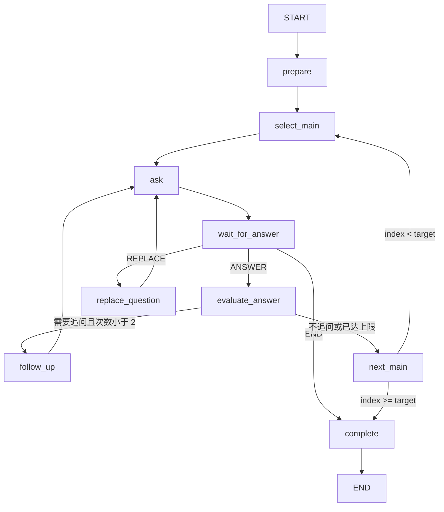

# 阶段 3 面试图

## 图节点与条件边

| 节点 | 职责 |
|---|---|
| `prepare` | 校验版本、目标问题数和计划长度，初始化图状态 |
| `select_main` | 按当前主问题序号从持久化问题计划取题 |
| `ask` / `wait_for_answer` | 建立等待边界；`wait_for_answer` 前设置 interrupt，回答以 `GraphInput.resume()` 继续 |
| `evaluate_answer` | 使用主问题、最近一条提问和已提交回答请求结构化追问决策；模型异常走有限 fallback |
| `follow_up` | 递增追问计数并生成追问 turn；计数不超过 2 |
| `next_main` | 完成当前主问题并路由下一题或结束 |
| `replace_question` | 用同一主问题槽位替换尚未作答的问题，不增加目标题数 |
| `complete` | 设置完成状态与结束原因 |

## Checkpoint state

`threadId` 固定为 Interview UUID。首次调用时图保存 `interviewId`、`userId`、模式、schema 版本、Resume / QuestionBank ID、主问题目标、问题计划和已使用题目来源 ID。运行中保存当前问题 ID/文本/类型、主问题序号、追问次数、换题次数、最近一条回答和已消费 turn ID。完整业务 transcript 仍以 `interview_turns` 为准，不复制完整简历与题库到每个 checkpoint。

所有恢复入口先用 `owner_id` 查业务 Interview；未通过 owner 校验不会调用 `lastStateOf(threadId)`。回答先写业务表并提交，再由持久化 transition worker 调用 Graph；`lastAnsweredTurnId` 防止重复消费。

## 业务状态与恢复

业务状态定义见 [INTERVIEW-STATE-MACHINE.md](INTERVIEW-STATE-MACHINE.md)。图节点不是业务状态。正常结束由 `next_main → complete` 驱动，业务层在事务中 `RUNNING → COMPLETING → COMPLETE`。提前结束先原子占位为 `COMPLETING` 并标记未回答 turn 为 `SKIPPED`，再恢复/推进 Graph 到 `complete` 并 finalize。过期 `COMPLETING` 在恢复 worker 中幂等补完。

换题通过 turn 上唯一 `replace_request_id` 做单活跃 claim 和重复请求回放。过期 claim 会对照 checkpoint：图已前进则落库替换问题；图未前进则释放 claim。模型失败发生在 Graph 修改之前会释放 claim，允许同一请求安全重试。

## 错误策略

- 题目计划少于 5、多于 8、重复或空白：拒绝启动，不进入运行状态。
- 追问输出结构错误、请求失败、空问题或重复原问题：跳过追问，继续下一主问题，并保存 `interview.error` 事件。
- 回答写库成功、SSE 发送失败：回答仍可从 turns API 恢复；SSE 不是事实来源。
- Graph / 数据库推进失败：保留业务回答和 transition / completing 状态，由 recovery worker 重试，不返回伪成功。

> 当前本地运行配置固定主问题目标 6；它满足 5–8 的阶段门槛。QuestionBank 模式要求至少 6 道已确认有效题目，详见模式差异记录。
